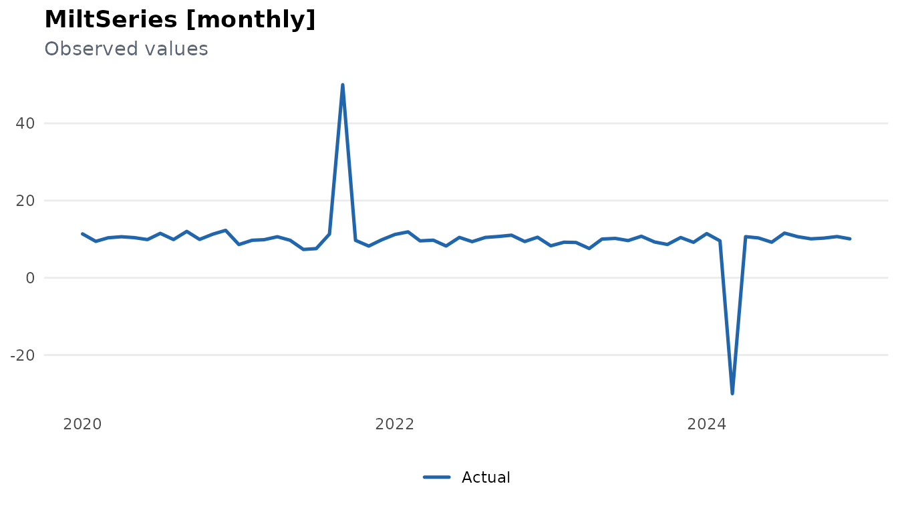
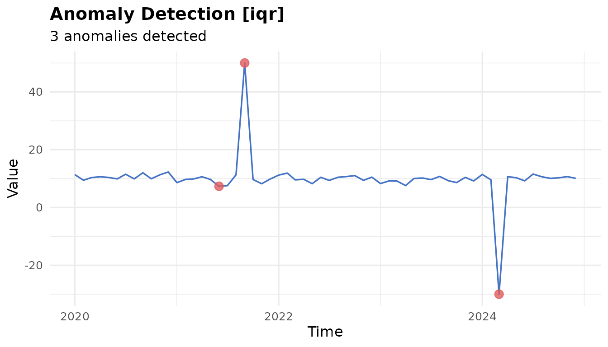
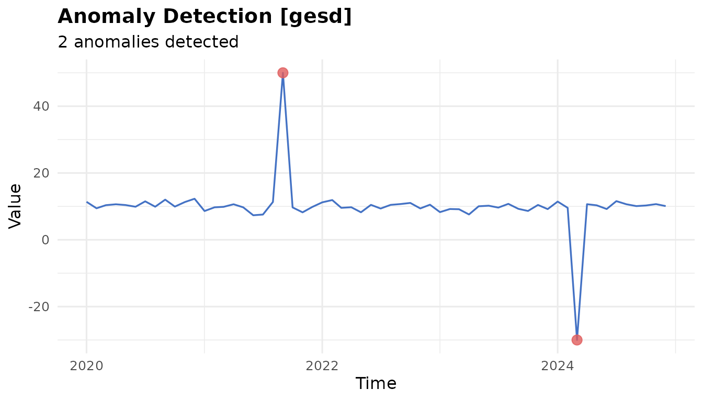
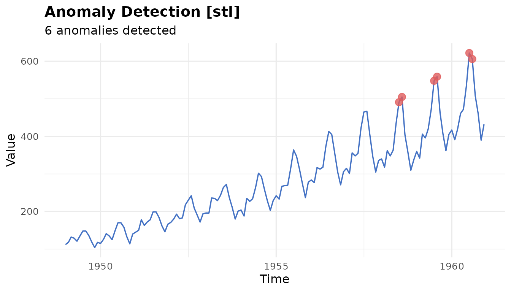
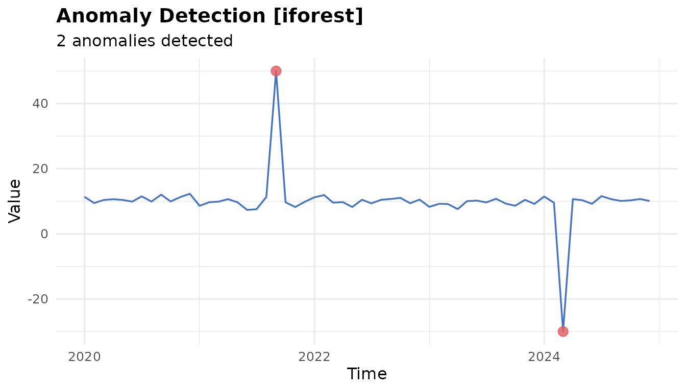
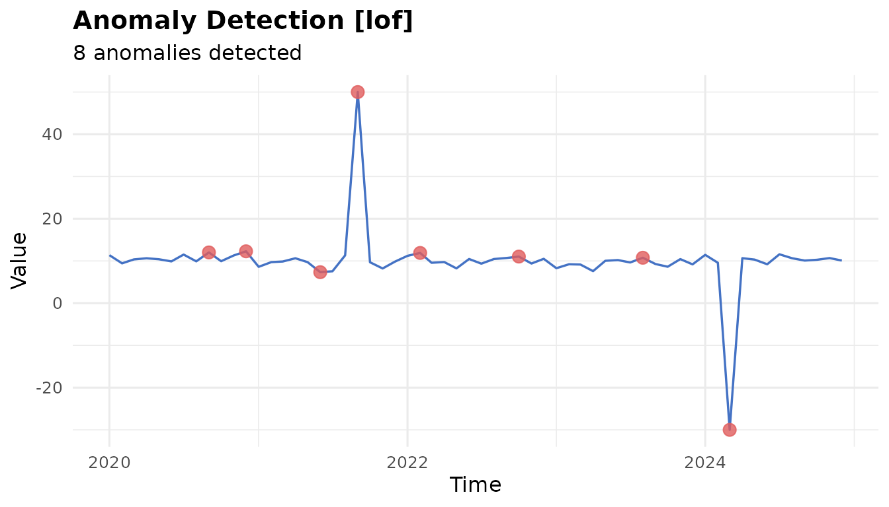
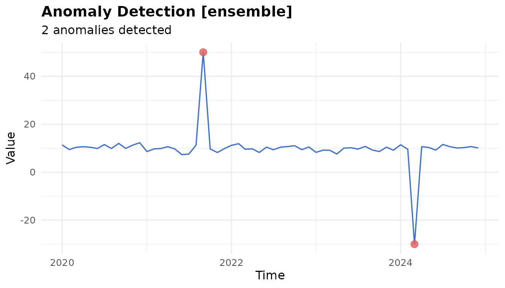
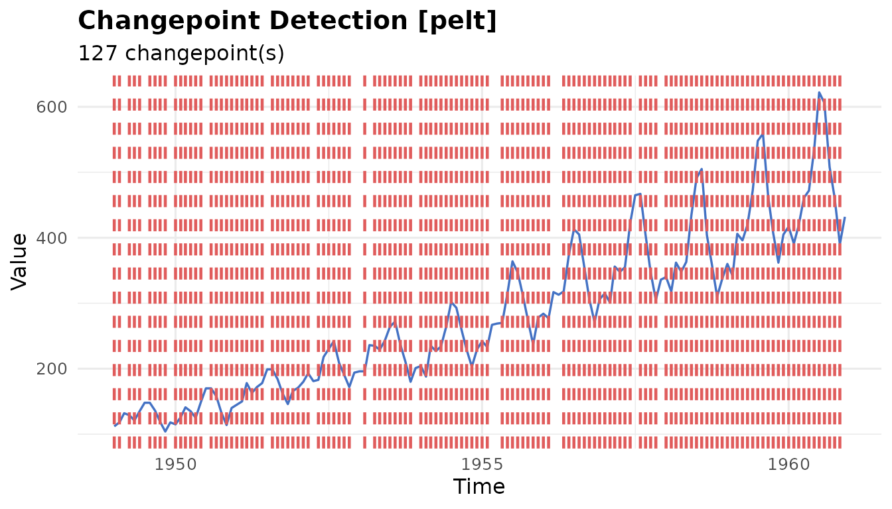

# Anomaly Detection with milt

``` r
library(milt)
#> milt 0.1.0 — Modern Integrated Library for Timeseries
#> Use `list_milt_models()` to see available models.
```

## Overview

milt’s anomaly detection API follows a two-step pattern:

``` r
detector <- milt_detector("<method>", ...)
anomalies <- milt_detect(detector, series)
```

Results are returned as a `MiltAnomalies` object with
[`print()`](https://rdrr.io/r/base/print.html),
[`plot()`](https://rdrr.io/r/graphics/plot.default.html), and
`as_tibble()` methods.

------------------------------------------------------------------------

## 1. Create a series with injected spikes

``` r
set.seed(42)
tbl <- tibble::tibble(
  date  = seq(as.Date("2020-01-01"), by = "month", length.out = 60),
  value = c(rnorm(20, 10, 1), 50, rnorm(19, 10, 1),   # spike at 21
             rnorm(10, 10, 1), -30, rnorm(9, 10, 1))   # dip at 51
)
s <- milt_series(tbl, time_col = "date", value_cols = "value")
plot(s)
```



------------------------------------------------------------------------

## 2. IQR detector (fast, no assumptions)

``` r
d   <- milt_detector("iqr", k = 1.5)
anm <- milt_detect(d, s)
print(anm)
#> # MiltAnomalies [iqr]
#> # Series    : 60 observations  2020-01-01 — 2024-12-01
#> # Anomalies : 3 / 60 (5%)# Anomalous times:
#> # A tibble: 3 × 3
#>   time        value .anomaly_score
#>   <date>      <dbl>          <dbl>
#> 1 2021-06-01   7.34         0.0957
#> 2 2021-09-01  50           29.3   
#> 3 2024-03-01 -30           29.3
plot(anm)
```



------------------------------------------------------------------------

## 3. GESD test (statistical, iterative)

``` r
d_gesd <- milt_detector("gesd", max_anoms = 5, alpha = 0.05)
anm_gesd <- milt_detect(d_gesd, s)
plot(anm_gesd)
```



------------------------------------------------------------------------

## 4. STL decomposition–based

STL separates trend and seasonality; anomalies are in the remainder:

``` r
air <- milt_series(AirPassengers)
d_stl  <- milt_detector("stl", threshold = 3)
anm_stl <- milt_detect(d_stl, air)
print(anm_stl)
#> # MiltAnomalies [stl]
#> # Series    : 144 observations  1949-01-01 — 1960-12-01
#> # Anomalies : 6 / 144 (4.2%)# Anomalous times:
#> # A tibble: 6 × 3
#>   time       value .anomaly_score
#>   <date>     <dbl>          <dbl>
#> 1 1958-07-01   491           3.17
#> 2 1958-08-01   505           3.36
#> 3 1959-07-01   548           3.54
#> 4 1959-08-01   559           3.53
#> 5 1960-07-01   622           4.39
#> 6 1960-08-01   606           3.44
plot(anm_stl)
```



------------------------------------------------------------------------

## 5. Isolation Forest

Requires the `isotree` package:

``` r
d_if  <- milt_detector("iforest", n_trees = 50, threshold = 0.6)
anm_if <- milt_detect(d_if, s)
plot(anm_if)
```



------------------------------------------------------------------------

## 6. Local Outlier Factor

Requires the `dbscan` package:

``` r
d_lof  <- milt_detector("lof", k = 5, threshold = 1.5)
anm_lof <- milt_detect(d_lof, s)
plot(anm_lof)
```



------------------------------------------------------------------------

## 7. Ensemble detection

Combine multiple detectors with majority vote or mean score:

``` r
d1  <- milt_detector("iqr",   k = 1.5)
d2  <- milt_detector("grubbs", alpha = 0.05)
d3  <- milt_detector("gesd",  max_anoms = 5)

ens <- milt_detector("ensemble",
                      detectors = list(d1, d2, d3),
                      method    = "majority")
anm_ens <- milt_detect(ens, s)
plot(anm_ens)
```



------------------------------------------------------------------------

## 8. Changepoint detection

``` r
cp <- milt_changepoints(air, method = "pelt", stat = "mean")
print(cp)
#> # MiltChangepoints [pelt]
#> # Series      : 144 obs  1949-01-01 — 1960-12-01
#> # Changepoints: 127# Locations:
#> # A tibble: 127 × 2
#>    index time      
#>    <int> <date>    
#>  1     1 1949-01-01
#>  2     2 1949-02-01
#>  3     4 1949-04-01
#>  4     5 1949-05-01
#>  5     6 1949-06-01
#>  6     8 1949-08-01
#>  7     9 1949-09-01
#>  8    10 1949-10-01
#>  9    11 1949-11-01
#> 10    13 1950-01-01
#> # ℹ 117 more rows
plot(cp)
```



------------------------------------------------------------------------

## 9. Tidy output

``` r
tbl_out <- tibble::as_tibble(milt_detect(milt_detector("iqr"), s))
head(tbl_out)
#> # A tibble: 6 × 6
#>   time       value .is_anomaly .anomaly_score is_anomaly anomaly_score
#>   <date>     <dbl> <lgl>                <dbl> <lgl>              <dbl>
#> 1 2020-01-01 11.4  FALSE                    0 FALSE                  0
#> 2 2020-02-01  9.44 FALSE                    0 FALSE                  0
#> 3 2020-03-01 10.4  FALSE                    0 FALSE                  0
#> 4 2020-04-01 10.6  FALSE                    0 FALSE                  0
#> 5 2020-05-01 10.4  FALSE                    0 FALSE                  0
#> 6 2020-06-01  9.89 FALSE                    0 FALSE                  0
```
