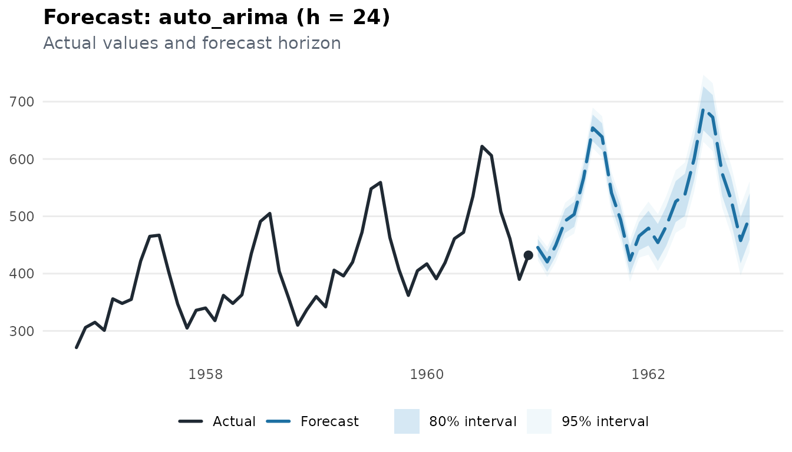
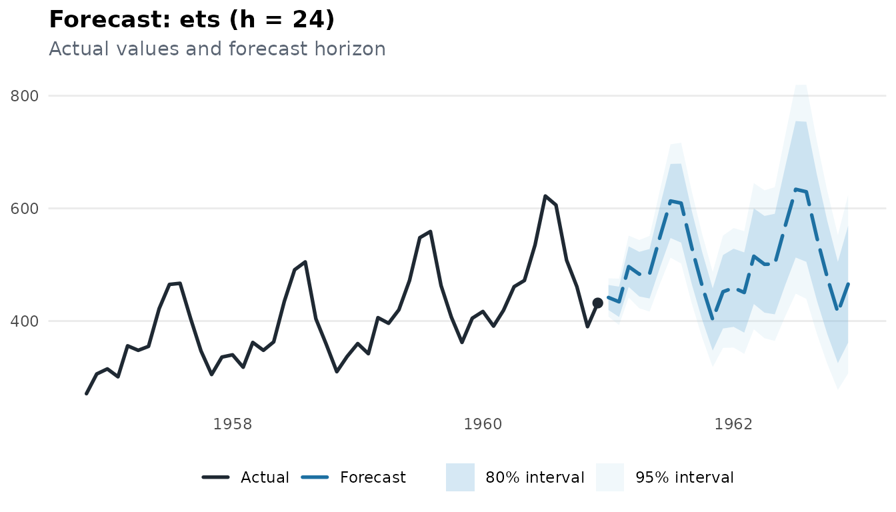
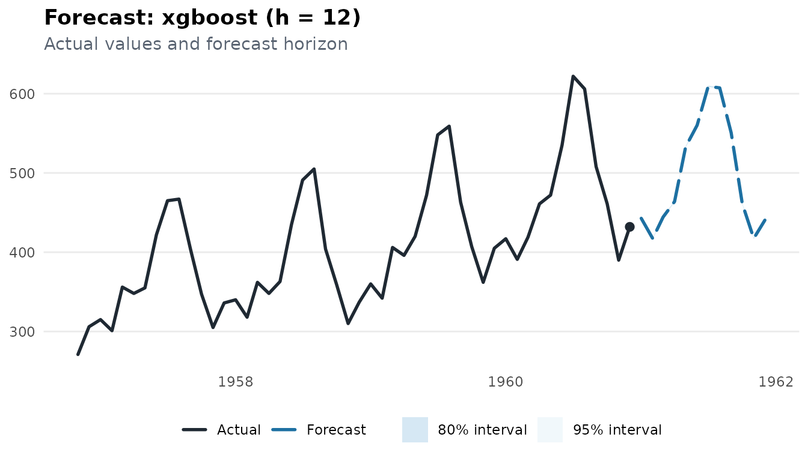
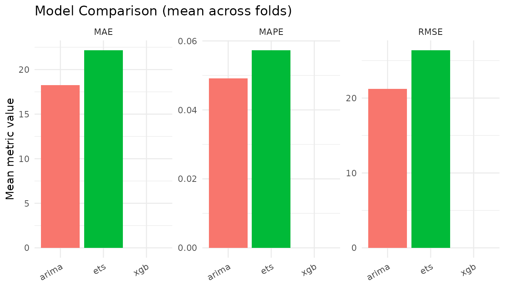
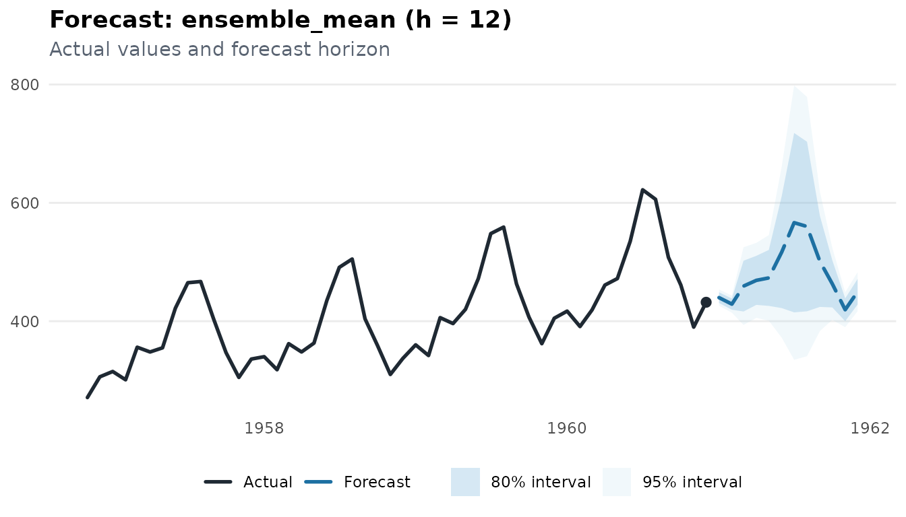
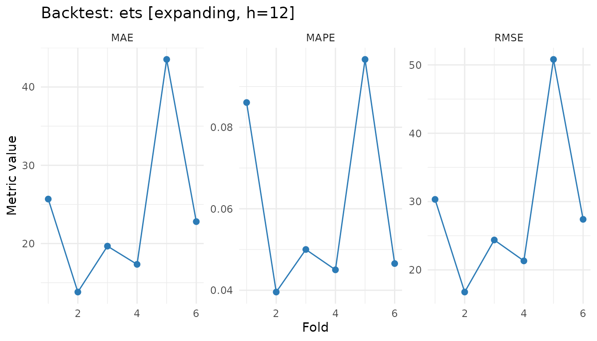

# Forecasting with milt

``` r
library(milt)
#> milt 0.1.0 — Modern Integrated Library for Timeseries
#> Use `list_milt_models()` to see available models.
```

## Overview

This vignette walks through milt’s full forecasting model zoo — from
classical statistical models to machine learning and ensembles — using a
single consistent API.

``` r
milt_model("<name>") |> milt_fit(series) |> milt_forecast(horizon = 12)
```

------------------------------------------------------------------------

## 1. The model zoo

List every registered model:

``` r
list_milt_models()
#> # A tibble: 25 × 6
#>    name           description multivariate probabilistic covariates multi_series
#>    <chr>          <chr>       <lgl>        <lgl>         <lgl>      <lgl>       
#>  1 snaive         "Seasonal … FALSE        TRUE          FALSE      FALSE       
#>  2 ets            "Exponenti… FALSE        TRUE          FALSE      FALSE       
#>  3 nbeats         ""          FALSE        FALSE         FALSE      FALSE       
#>  4 auto_arima     "Automatic… FALSE        TRUE          TRUE       FALSE       
#>  5 knn            "K-Nearest… FALSE        TRUE          FALSE      FALSE       
#>  6 svm            "Support V… FALSE        TRUE          FALSE      FALSE       
#>  7 stl            "STL decom… FALSE        TRUE          FALSE      FALSE       
#>  8 elastic_net    ""          FALSE        FALSE         FALSE      FALSE       
#>  9 deepar         ""          FALSE        FALSE         FALSE      FALSE       
#> 10 darts_transfo… ""          FALSE        FALSE         FALSE      FALSE       
#> # ℹ 15 more rows
```

------------------------------------------------------------------------

## 2. Classical models

``` r
air <- milt_series(AirPassengers)

# Auto-ARIMA
fct_arima <- milt_model("auto_arima") |> milt_fit(air) |> milt_forecast(24)
#> Fitting <MiltAutoArima> model…
#> Done in 1.29s.
plot(fct_arima)
```



``` r

# ETS
fct_ets <- milt_model("ets") |> milt_fit(air) |> milt_forecast(24)
#> Fitting <MiltEts> model…
#> Done in 0.62s.
plot(fct_ets)
```



------------------------------------------------------------------------

## 3. Train/test evaluation

``` r
spl <- milt_split(air, ratio = 0.8)
h   <- spl$test$n_timesteps()

fct_cv <- milt_model("ets") |>
  milt_fit(spl$train) |>
  milt_forecast(h)
#> Fitting <MiltEts> model…
#> Done in 0.58s.

milt_accuracy(spl$test$values(), fct_cv$as_tibble()$.mean)
#> # A tibble: 5 × 2
#>   metric     value
#>   <chr>      <dbl>
#> 1 MAE      30.0   
#> 2 MSE    1282.    
#> 3 RMSE     35.8   
#> 4 MAPE      0.0653
#> 5 R2        0.790
```

------------------------------------------------------------------------

## 4. ML models with lag features

XGBoost, LightGBM, random forest, and elastic net all use automatic lag
features. You can customise the lags:

``` r
fct_xgb <- milt_model("xgboost", lags = 1:12) |>
  milt_fit(air) |>
  milt_forecast(12)
#> Fitting <MiltXGBoost> model…
#> Done in 0.05s.
plot(fct_xgb)
```



------------------------------------------------------------------------

## 5. Model comparison

[`milt_compare()`](https://ntiGideon.github.io/milt/reference/milt_compare.md)
runs a rolling-origin backtest on each model and ranks them:

``` r
models <- list(
  arima  = milt_model("auto_arima"),
  ets    = milt_model("ets"),
  xgb    = milt_model("xgboost", lags = 1:12)
)
cmp <- milt_compare(models, air, horizon = 12)
#> Comparing 3 models: arima, ets, xgb
#> Running backtest for "arima"...
#> Running expanding backtest (61 folds): auto_arima, h=12
#> Running backtest for "ets"...
#> Running expanding backtest (61 folds): ets, h=12
#> Running backtest for "xgb"...
#> Running expanding backtest (61 folds): xgboost, h=12
#> Warning: Fold 1 failed: attempt to apply non-function
#> Warning: Fold 2 failed: attempt to apply non-function
#> Warning: Fold 3 failed: attempt to apply non-function
#> Warning: Fold 4 failed: attempt to apply non-function
#> Warning: Fold 5 failed: attempt to apply non-function
#> Warning: Fold 6 failed: attempt to apply non-function
#> Warning: Fold 7 failed: attempt to apply non-function
#> Warning: Fold 8 failed: attempt to apply non-function
#> Warning: Fold 9 failed: attempt to apply non-function
#> Warning: Fold 10 failed: attempt to apply non-function
#> Warning: Fold 11 failed: attempt to apply non-function
#> Warning: Fold 12 failed: attempt to apply non-function
#> Warning: Fold 13 failed: attempt to apply non-function
#> Warning: Fold 14 failed: attempt to apply non-function
#> Warning: Fold 15 failed: attempt to apply non-function
#> Warning: Fold 16 failed: attempt to apply non-function
#> Warning: Fold 17 failed: attempt to apply non-function
#> Warning: Fold 18 failed: attempt to apply non-function
#> Warning: Fold 19 failed: attempt to apply non-function
#> Warning: Fold 20 failed: attempt to apply non-function
#> Warning: Fold 21 failed: attempt to apply non-function
#> Warning: Fold 22 failed: attempt to apply non-function
#> Warning: Fold 23 failed: attempt to apply non-function
#> Warning: Fold 24 failed: attempt to apply non-function
#> Warning: Fold 25 failed: attempt to apply non-function
#> Warning: Fold 26 failed: attempt to apply non-function
#> Warning: Fold 27 failed: attempt to apply non-function
#> Warning: Fold 28 failed: attempt to apply non-function
#> Warning: Fold 29 failed: attempt to apply non-function
#> Warning: Fold 30 failed: attempt to apply non-function
#> Warning: Fold 31 failed: attempt to apply non-function
#> Warning: Fold 32 failed: attempt to apply non-function
#> Warning: Fold 33 failed: attempt to apply non-function
#> Warning: Fold 34 failed: attempt to apply non-function
#> Warning: Fold 35 failed: attempt to apply non-function
#> Warning: Fold 36 failed: attempt to apply non-function
#> Warning: Fold 37 failed: attempt to apply non-function
#> Warning: Fold 38 failed: attempt to apply non-function
#> Warning: Fold 39 failed: attempt to apply non-function
#> Warning: Fold 40 failed: attempt to apply non-function
#> Warning: Fold 41 failed: attempt to apply non-function
#> Warning: Fold 42 failed: attempt to apply non-function
#> Warning: Fold 43 failed: attempt to apply non-function
#> Warning: Fold 44 failed: attempt to apply non-function
#> Warning: Fold 45 failed: attempt to apply non-function
#> Warning: Fold 46 failed: attempt to apply non-function
#> Warning: Fold 47 failed: attempt to apply non-function
#> Warning: Fold 48 failed: attempt to apply non-function
#> Warning: Fold 49 failed: attempt to apply non-function
#> Warning: Fold 50 failed: attempt to apply non-function
#> Warning: Fold 51 failed: attempt to apply non-function
#> Warning: Fold 52 failed: attempt to apply non-function
#> Warning: Fold 53 failed: attempt to apply non-function
#> Warning: Fold 54 failed: attempt to apply non-function
#> Warning: Fold 55 failed: attempt to apply non-function
#> Warning: Fold 56 failed: attempt to apply non-function
#> Warning: Fold 57 failed: attempt to apply non-function
#> Warning: Fold 58 failed: attempt to apply non-function
#> Warning: Fold 59 failed: attempt to apply non-function
#> Warning: Fold 60 failed: attempt to apply non-function
#> Warning: Fold 61 failed: attempt to apply non-function
print(cmp)
#> 
#> ── MiltComparison - 3 models ──
#> 
#> • Rank metric : MAE
#> • Models : arima, ets, xgb
#> 
#> ── Ranked by MAE (mean across folds)
#> Warning in min(x, na.rm = TRUE): no non-missing arguments to min; returning Inf
#> Warning in max(x, na.rm = TRUE): no non-missing arguments to max; returning
#> -Inf
#> Warning in min(x, na.rm = TRUE): no non-missing arguments to min; returning Inf
#> Warning in max(x, na.rm = TRUE): no non-missing arguments to max; returning
#> -Inf
#> Warning in min(x, na.rm = TRUE): no non-missing arguments to min; returning Inf
#> Warning in max(x, na.rm = TRUE): no non-missing arguments to max; returning
#> -Inf
#> # A tibble: 3 × 5
#>   model   MAE  RMSE     MAPE  rank
#>   <chr> <dbl> <dbl>    <dbl> <int>
#> 1 arima  18.3  21.2   0.0491     1
#> 2 ets    22.2  26.4   0.0573     2
#> 3 xgb   NaN   NaN   NaN          3
plot(cmp)
#> Warning: Removed 3 rows containing missing values or values outside the scale range
#> (`geom_col()`).
```



------------------------------------------------------------------------

## 6. Ensemble models

Combine forecasts with a mean ensemble:

``` r
m1 <- milt_model("auto_arima") |> milt_fit(air)
#> Fitting <MiltAutoArima> model…
#> Done in 1.23s.
m2 <- milt_model("ets")        |> milt_fit(air)
#> Fitting <MiltEts> model…
#> Done in 0.63s.
m3 <- milt_model("naive")      |> milt_fit(air)
#> Fitting <MiltNaive> model…
#> Done in 0s.

ens <- milt_ensemble(list(arima = m1, ets = m2, naive = m3), method = "mean")
fct_ens <- milt_forecast(ens, 12)
plot(fct_ens)
```



------------------------------------------------------------------------

## 7. Probabilistic forecasts

Every model returns 80% and 95% prediction intervals. Access them via
`as_tibble()`:

``` r
tbl <- fct_arima$as_tibble()
head(tbl)
#> # A tibble: 6 × 7
#>   time       .model     .mean .lower_80 .upper_80 .lower_95 .upper_95
#>   <date>     <chr>      <dbl>     <dbl>     <dbl>     <dbl>     <dbl>
#> 1 1961-01-01 auto_arima  446.      431.      460.      423.      468.
#> 2 1961-02-01 auto_arima  420.      403.      438.      394.      447.
#> 3 1961-03-01 auto_arima  449.      430.      469.      419.      479.
#> 4 1961-04-01 auto_arima  492.      471.      513.      460.      524.
#> 5 1961-05-01 auto_arima  503.      482.      525.      470.      537.
#> 6 1961-06-01 auto_arima  567.      544.      589.      532.      601.
```

For sample-path–based probabilistic forecasts, use `num_samples`:

``` r
fct_samples <- milt_model("naive") |>
  milt_fit(air) |>
  milt_forecast(12, num_samples = 200)
```

------------------------------------------------------------------------

## 8. Backtesting

[`milt_backtest()`](https://ntiGideon.github.io/milt/reference/milt_backtest.md)
implements expanding- and sliding-window CV:

``` r
bt <- milt_backtest(
  milt_model("ets"),
  series  = air,
  horizon = 12,
  stride  = 12,
  method  = "expanding"
)
#> Running expanding backtest (6 folds): ets, h=12
print(bt)
#> 
#> ── MiltBacktest <ets> ──
#> 
#> • Method : expanding
#> • Horizon : 12
#> • Folds : 6
#> 
#> ── Summary (across folds)
#> # A tibble: 3 × 5
#>   metric    mean      sd     min     max
#>   <chr>    <dbl>   <dbl>   <dbl>   <dbl>
#> 1 MAE    23.8    10.5    13.8    43.5   
#> 2 RMSE   28.5    11.9    16.8    50.8   
#> 3 MAPE    0.0606  0.0243  0.0396  0.0967
plot(bt)
```


