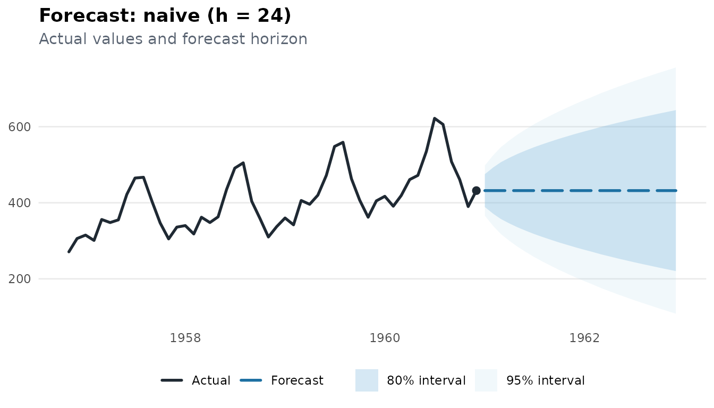
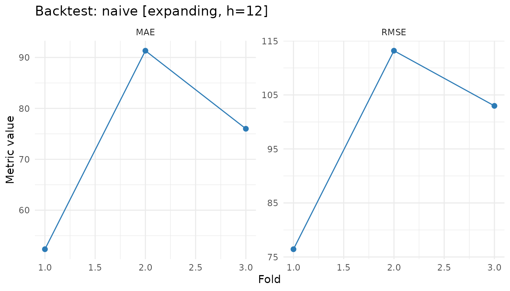

# Getting Started with milt

``` r
library(milt)
#> milt 0.1.0 — Modern Integrated Library for Timeseries
#> Use `list_milt_models()` to see available models.
```

## Overview

**milt** (Modern Integrated Library for Timeseries) provides a single,
consistent API for every time series task: forecasting, anomaly
detection, classification, and clustering. Every model follows the same
three-step pipe:

``` r
milt_model("<name>") |> milt_fit(series) |> milt_forecast(horizon)
```

This vignette walks through the core workflow using the built-in
`AirPassengers` dataset.

------------------------------------------------------------------------

## 1. Creating a MiltSeries

[`milt_series()`](https://ntiGideon.github.io/milt/reference/milt_series.md)
accepts virtually any R time series object: a `ts`, a `data.frame`, a
`tibble`, an `xts`, a `tsibble`, or a plain numeric vector.

``` r
# From a base-R ts object
air <- milt_series(AirPassengers)
print(air)
#> # A MiltSeries: 144 x 1 [monthly]
#> # Time range : 1949 Jan — 1960 Dec
#> # Components : value
#> # Gaps       : none
#> # A tibble: 6 × 2
#>   time       value
#>   <date>     <dbl>
#> 1 1949-01-01   112
#> 2 1949-02-01   118
#> 3 1949-03-01   132
#> 4 1949-04-01   129
#> 5 1949-05-01   121
#> 6 1949-06-01   135
#> # … with 138 more rows
```

You can also build a series from a tibble and control every option:

``` r
data(milt_air)
air2 <- milt_series(
  milt_air,
  time_col  = "date",
  value_cols = "value",
  frequency = "monthly"
)
```

Key accessors on a `MiltSeries`:

``` r
air$n_timesteps()   # number of observations
#> [1] 144
air$freq()          # detected frequency label
#> [1] "monthly"
air$start_time()    # first time index
#> [1] "1949-01-01"
air$end_time()      # last time index
#> [1] "1960-12-01"
air$values()        # numeric vector of the target variable
#>   [1] 112 118 132 129 121 135 148 148 136 119 104 118 115 126 141 135 125 149
#>  [19] 170 170 158 133 114 140 145 150 178 163 172 178 199 199 184 162 146 166
#>  [37] 171 180 193 181 183 218 230 242 209 191 172 194 196 196 236 235 229 243
#>  [55] 264 272 237 211 180 201 204 188 235 227 234 264 302 293 259 229 203 229
#>  [73] 242 233 267 269 270 315 364 347 312 274 237 278 284 277 317 313 318 374
#>  [91] 413 405 355 306 271 306 315 301 356 348 355 422 465 467 404 347 305 336
#> [109] 340 318 362 348 363 435 491 505 404 359 310 337 360 342 406 396 420 472
#> [127] 548 559 463 407 362 405 417 391 419 461 472 535 622 606 508 461 390 432
```

------------------------------------------------------------------------

## 2. Diagnosing a series

[`milt_diagnose()`](https://ntiGideon.github.io/milt/reference/milt_diagnose.md)
runs a quick statistical battery: trend test, stationarity check,
seasonality strength, and outlier count.

``` r
dx <- milt_diagnose(air)
print(dx)
#> # MiltDiagnosis
#> # Series    : 144 obs @ monthly# Range     : 1949-01-01 — 1960-12-01
#> Stationarity : stationary (CV ratio = 0.028)Seasonality  : seasonal (strength = 0.462, period = 12)Trend        : trend present (slope = 2.6572, p = 0)Gaps         : noneOutliers     : none
#> Recommendations:
#> • Significant linear trend detected. Models without detrending may underfit.• Seasonality detected (strength = 0.46, period = 12). Use a seasonal model (ETS, SARIMA, STL).
```

------------------------------------------------------------------------

## 3. Fitting and forecasting

Use
[`milt_model()`](https://ntiGideon.github.io/milt/reference/milt_model.md)
to select a model by name,
[`milt_fit()`](https://ntiGideon.github.io/milt/reference/milt_fit.md)
to train it, and
[`milt_forecast()`](https://ntiGideon.github.io/milt/reference/milt_forecast.md)
to produce point forecasts plus 80% and 95% prediction intervals.

``` r
fct <- milt_model("naive") |>
  milt_fit(air) |>
  milt_forecast(horizon = 24)
#> Fitting <MiltNaive> model…
#> Done in 0s.

print(fct)
#> # A MiltForecast <naive>: horizon = 24# Forecast from: 1960-12-01# Intervals    : 80, 95%#
#> # A tibble: 6 × 7
#>   time       .model .mean .lower_80 .upper_80 .lower_95 .upper_95
#>   <date>     <chr>  <dbl>     <dbl>     <dbl>     <dbl>     <dbl>
#> 1 1961-01-01 naive    432      389.      475.      366.      498.
#> 2 1961-02-01 naive    432      371.      493.      339.      525.
#> 3 1961-03-01 naive    432      357.      507.      318.      546.
#> 4 1961-04-01 naive    432      346.      518.      300.      564.
#> 5 1961-05-01 naive    432      335.      529.      284.      580.
#> 6 1961-06-01 naive    432      326.      538.      270.      594.
#> # … with 18 more rows
```

The result is a `MiltForecast` object. Convert it to a tibble for
downstream work:

``` r
head(fct$as_tibble())
#> # A tibble: 6 × 7
#>   time       .model .mean .lower_80 .upper_80 .lower_95 .upper_95
#>   <date>     <chr>  <dbl>     <dbl>     <dbl>     <dbl>     <dbl>
#> 1 1961-01-01 naive    432      389.      475.      366.      498.
#> 2 1961-02-01 naive    432      371.      493.      339.      525.
#> 3 1961-03-01 naive    432      357.      507.      318.      546.
#> 4 1961-04-01 naive    432      346.      518.      300.      564.
#> 5 1961-05-01 naive    432      335.      529.      284.      580.
#> 6 1961-06-01 naive    432      326.      538.      270.      594.
```

Plot the forecast with history:

``` r
plot(fct)
```



### Choosing a model

``` r
list_milt_models()
#> # A tibble: 25 × 6
#>    name           description multivariate probabilistic covariates multi_series
#>    <chr>          <chr>       <lgl>        <lgl>         <lgl>      <lgl>       
#>  1 snaive         "Seasonal … FALSE        TRUE          FALSE      FALSE       
#>  2 ets            "Exponenti… FALSE        TRUE          FALSE      FALSE       
#>  3 nbeats         ""          FALSE        FALSE         FALSE      FALSE       
#>  4 auto_arima     "Automatic… FALSE        TRUE          TRUE       FALSE       
#>  5 knn            "K-Nearest… FALSE        TRUE          FALSE      FALSE       
#>  6 svm            "Support V… FALSE        TRUE          FALSE      FALSE       
#>  7 stl            "STL decom… FALSE        TRUE          FALSE      FALSE       
#>  8 elastic_net    ""          FALSE        FALSE         FALSE      FALSE       
#>  9 deepar         ""          FALSE        FALSE         FALSE      FALSE       
#> 10 darts_transfo… ""          FALSE        FALSE         FALSE      FALSE       
#> # ℹ 15 more rows
```

Swap `"naive"` for any registered key. Models backed by the `forecast`
package (ETS, ARIMA, Theta, STL) are loaded lazily and only require the
`forecast` package to be installed.

``` r
fct_ets <- milt_model("ets") |>
  milt_fit(air) |>
  milt_forecast(horizon = 24)
#> Fitting <MiltEts> model…
#> Done in 0.62s.

plot(fct_ets)
```


------------------------------------------------------------------------

## 4. Evaluating accuracy

Split the series into training and test sets, forecast over the test
horizon, and compute accuracy metrics:

``` r
spl <- milt_split(air, ratio = 0.8)   # 80 % train, 20 % test

fct_test <- milt_model("naive") |>
  milt_fit(spl$train) |>
  milt_forecast(spl$test$n_timesteps())
#> Fitting <MiltNaive> model…
#> Done in 0s.

acc <- milt_accuracy(
  actual    = spl$test$values(),
  predicted = fct_test$as_tibble()$.mean
)
print(acc)
#> # A tibble: 5 × 2
#>   metric    value
#>   <chr>     <dbl>
#> 1 MAE      81.4  
#> 2 MSE    8674.   
#> 3 RMSE     93.1  
#> 4 MAPE      0.202
#> 5 R2       -0.421
```

------------------------------------------------------------------------

## 5. Walk-forward backtesting

[`milt_backtest()`](https://ntiGideon.github.io/milt/reference/milt_backtest.md)
performs time series cross-validation without data leakage. Two
strategies are supported:

- **expanding** (default) — the training window grows fold by fold.
- **sliding** — a fixed-size training window advances by `stride` steps.

``` r
bt <- milt_backtest(
  model          = milt_model("naive"),
  series         = air,
  horizon        = 12,
  initial_window = 108L,
  stride         = 12L,
  metrics        = c("MAE", "RMSE")
)
#> Running expanding backtest (3 folds): naive, h=12

print(bt)
#> 
#> ── MiltBacktest <naive> ──
#> 
#> • Method : expanding
#> • Horizon : 12
#> • Folds : 3
#> 
#> ── Summary (across folds)
#> # A tibble: 2 × 5
#>   metric  mean    sd   min   max
#>   <chr>  <dbl> <dbl> <dbl> <dbl>
#> 1 MAE     73.2  19.6  52.3  91.3
#> 2 RMSE    97.5  19.0  76.4 113.
plot(bt)
```



Retrieve per-fold results as a tibble:

``` r
tibble::as_tibble(bt)
#> # A tibble: 3 × 5
#>   .fold .train_n .test_n  .MAE .RMSE
#>   <int>    <int>   <int> <dbl> <dbl>
#> 1     1      108      12  52.3  76.4
#> 2     2      120      12  91.3 113. 
#> 3     3      132      12  76   103.
```

------------------------------------------------------------------------

## 6. Handling gaps and missing data

``` r
# Detect and fill gaps with linear interpolation
air_gapped <- air   # hypothetical series with missing values
air_filled <- milt_fill_gaps(air_gapped, method = "linear")
```

Other imputation methods: `"spline"`, `"locf"`, `"nocb"`, `"mean"`,
`"zero"`.

------------------------------------------------------------------------

## 7. Series manipulation

``` r
# Subset to 1955-1960
air_55 <- milt_window(air,
                      start = as.Date("1955-01-01"),
                      end   = as.Date("1960-12-01"))
air_55$n_timesteps()
#> [1] 72

# Head / tail
milt_head(air, 12)$n_timesteps()
#> [1] 12
milt_tail(air, 12)$n_timesteps()
#> [1] 12
```

------------------------------------------------------------------------

## Next steps

- See `vignette("milt-backends")` for a complete model catalogue (coming
  soon).
- See `vignette("milt-covariates")` for covariate-aware forecasting.
- Visit <https://github.com/ntiGideon/milt> to follow development or
  open an issue.
