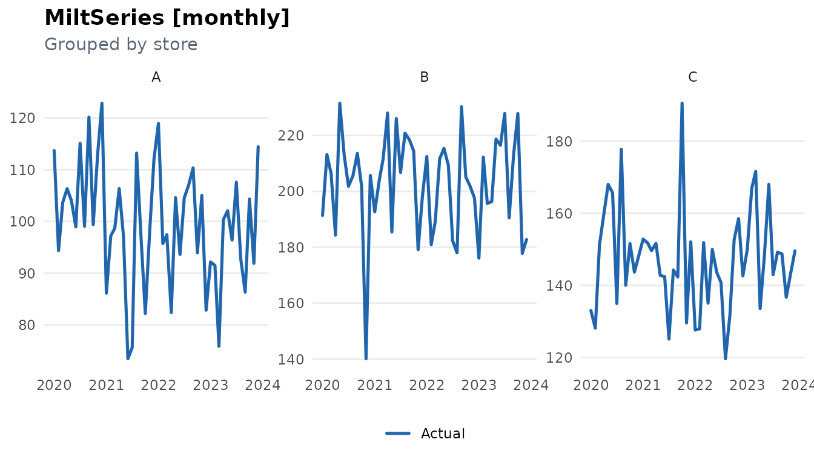
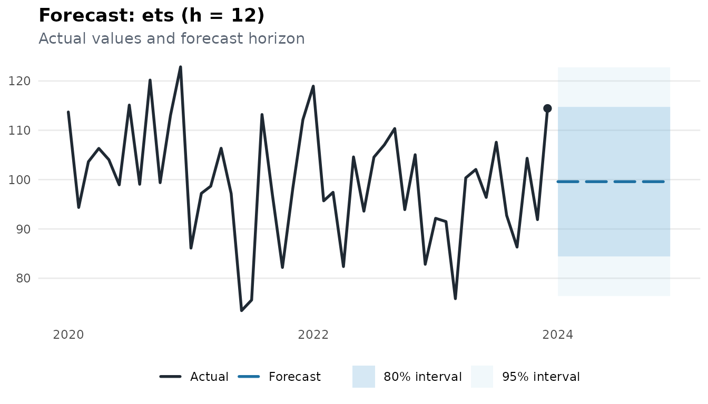

# Working with Multiple Series

``` r
library(milt)
#> milt 0.1.0 — Modern Integrated Library for Timeseries
#> Use `list_milt_models()` to see available models.
```

## Overview

milt handles multi-series data natively. A grouped `MiltSeries` stores
multiple series in a single object, and
[`milt_local_model()`](https://ntiGideon.github.io/milt/reference/milt_local_model.md)
fits one model per series in parallel.

------------------------------------------------------------------------

## 1. Creating a multi-series MiltSeries

``` r
# Build a synthetic dataset with 3 stores
set.seed(42)
n   <- 48L
tbl <- tibble::tibble(
  date     = rep(seq(as.Date("2020-01-01"), by = "month", length.out = n), 3),
  store    = rep(c("A", "B", "C"), each = n),
  sales    = c(
    rnorm(n, 100, 10),
    rnorm(n, 200, 20),
    rnorm(n, 150, 15)
  )
)

ms <- milt_series(tbl,
                   time_col  = "date",
                   value_cols = "sales",
                   group_col = "store")
print(ms)
#> # A MiltSeries: 48 x 1 [monthly] | 3 series
#> # Time range : 2020 Jan — 2023 Dec
#> # Components : sales
#> # Groups     : store (3 series)
#> # Gaps       : none
#> # A tibble: 6 × 3
#>   date       store sales
#>   <date>     <chr> <dbl>
#> 1 2020-01-01 A     114. 
#> 2 2020-02-01 A      94.4
#> 3 2020-03-01 A     104. 
#> 4 2020-04-01 A     106. 
#> 5 2020-05-01 A     104. 
#> 6 2020-06-01 A      98.9
#> # … with 138 more rows
```

------------------------------------------------------------------------

## 2. Visualise all series

``` r
plot(ms)
```



------------------------------------------------------------------------

## 3. Local models — one per series

[`milt_local_model()`](https://ntiGideon.github.io/milt/reference/milt_local_model.md)
wraps any model to train independently on each group:

``` r
local_m <- milt_local_model(milt_model("ets"))
fitted  <- milt_fit(local_m, ms)
#> Fitting <MiltLocalModel> model…
#> Local model: fitting 3 groups…
#> Done in 1.71s.
fct     <- milt_forecast(fitted, 12)
#> Local model: generating forecasts for 3 groups.
print(fct)
#> # A MiltForecast <ets>: horizon = 12# Forecast from: 2023-12-01# Intervals    : 80, 95%#
#> # A tibble: 6 × 7
#>   time       .model .mean .lower_80 .upper_80 .lower_95 .upper_95
#>   <date>     <chr>  <dbl>     <dbl>     <dbl>     <dbl>     <dbl>
#> 1 2024-01-01 ets     99.6      84.4      115.      76.4      123.
#> 2 2024-02-01 ets     99.6      84.4      115.      76.4      123.
#> 3 2024-03-01 ets     99.6      84.4      115.      76.4      123.
#> 4 2024-04-01 ets     99.6      84.4      115.      76.4      123.
#> 5 2024-05-01 ets     99.6      84.4      115.      76.4      123.
#> 6 2024-06-01 ets     99.6      84.4      115.      76.4      123.
#> # … with 6 more rows
plot(fct)
```



------------------------------------------------------------------------

## 4. Split and manipulate individual series

``` r
# Extract one group by filtering the underlying tibble
s_A <- milt_series(
  dplyr::filter(ms$as_tibble(), store == "A"),
  time_col   = "date",
  value_cols = "sales"
)

spl <- milt_split(s_A, ratio = 0.8)
cat("Train:", spl$train$n_timesteps(), "Test:", spl$test$n_timesteps(), "\n")
#> Train: 38 Test: 10
```

------------------------------------------------------------------------

## 5. Concatenate series

``` r
s1 <- milt_series(AirPassengers)[1:72]
s2 <- milt_series(AirPassengers)[73:144]
s_full <- milt_concat(s1, s2)
cat("Combined length:", s_full$n_timesteps(), "\n")
#> Combined length: 144
```

------------------------------------------------------------------------

## 6. Time series clustering

Group series by shape similarity:

``` r
# Create a list of separate MiltSeries for clustering
series_list <- lapply(c("A", "B", "C"), function(g) {
  milt_window(ms, group = g)
})

cl <- milt_cluster(series_list, k = 2L, method = "feature_based")
print(cl)
#> # MiltClusters [feature_based]
#> # Series: 3   Clusters: 2# Cluster sizes:
#> 
#> 1 2 
#> 2 1
```

------------------------------------------------------------------------

## 7. Time series classification

Train a classifier on labelled series:

``` r
# Assign synthetic labels
labels <- c("high", "high", "low")   # stores A, B, C

clf <- milt_classifier("feature_based")
milt_classify_fit(clf, series_list, labels)

pred <- milt_classify_predict(clf, series_list)
cat("Predicted labels:", pred$labels, "\n")
#> Predicted labels: high high high
```

------------------------------------------------------------------------

## 8. Hierarchical reconciliation

Ensure aggregate forecasts are coherent with bottom-level sums:

``` r
# Fit models for Total + each store
s_total <- milt_series(
  tibble::tibble(
    date  = seq(as.Date("2020-01-01"), by = "month", length.out = n),
    sales = tbl$sales[tbl$store == "A"] +
            tbl$sales[tbl$store == "B"] +
            tbl$sales[tbl$store == "C"]
  ),
  time_col = "date", value_cols = "sales"
)

fc_total <- milt_model("ets") |> milt_fit(s_total)  |> milt_forecast(6)
#> Fitting <MiltEts> model…
#> Done in 0.5s.
fc_A     <- milt_model("ets") |> milt_fit(series_list[[1L]]) |> milt_forecast(6)
#> Fitting <MiltEts> model…
#> Done in 0.56s.
fc_B     <- milt_model("ets") |> milt_fit(series_list[[2L]]) |> milt_forecast(6)
#> Fitting <MiltEts> model…
#> Done in 0.51s.
fc_C     <- milt_model("ets") |> milt_fit(series_list[[3L]]) |> milt_forecast(6)
#> Fitting <MiltEts> model…
#> Done in 0.47s.

# Summing matrix (Total = A + B + C)
S <- matrix(c(1,1,1, 1,0,0, 0,1,0, 0,0,1),
            nrow = 4, ncol = 3, byrow = TRUE,
            dimnames = list(c("Total","A","B","C"), c("A","B","C")))

rc <- milt_reconcile(
  list(Total = fc_total, A = fc_A, B = fc_B, C = fc_C),
  S      = S,
  method = "ols"
)
print(rc)
#> # MiltReconciliation [ols]
#> # Series: Total, A, B, C
```
