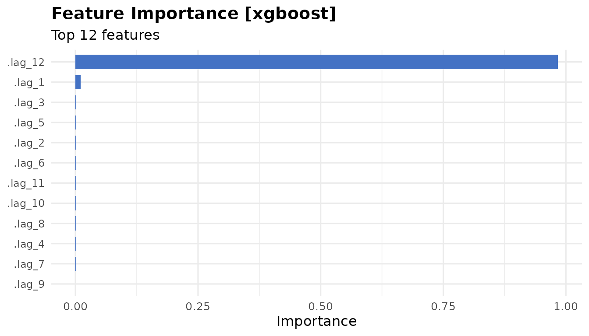

# Building Pipelines with milt

``` r
library(milt)
#> milt 0.1.0 — Modern Integrated Library for Timeseries
#> Use `list_milt_models()` to see available models.
```

## Overview

Feature engineering in milt is done with `milt_step_*()` functions that
each accept and return a `MiltSeries`. They compose naturally with the
native pipe `|>`.

------------------------------------------------------------------------

## 1. Lag features

``` r
air    <- milt_series(AirPassengers)
air_lg <- milt_step_lag(air, lags = 1:12)
print(air_lg)
#> # A MiltSeries: 132 x 1 [monthly]
#> # Time range : 1950 Jan — 1960 Dec
#> # Components : value
#> # Gaps       : none
#> # A tibble: 6 × 14
#>   time       value .lag_1 .lag_2 .lag_3 .lag_4 .lag_5 .lag_6 .lag_7 .lag_8
#>   <date>     <dbl>  <dbl>  <dbl>  <dbl>  <dbl>  <dbl>  <dbl>  <dbl>  <dbl>
#> 1 1950-01-01   115    118    104    119    136    148    148    135    121
#> 2 1950-02-01   126    115    118    104    119    136    148    148    135
#> 3 1950-03-01   141    126    115    118    104    119    136    148    148
#> 4 1950-04-01   135    141    126    115    118    104    119    136    148
#> 5 1950-05-01   125    135    141    126    115    118    104    119    136
#> 6 1950-06-01   149    125    135    141    126    115    118    104    119
#> # ℹ 4 more variables: .lag_9 <dbl>, .lag_10 <dbl>, .lag_11 <dbl>, .lag_12 <dbl>
#> # … with 126 more rows
```

------------------------------------------------------------------------

## 2. Rolling statistics

``` r
air_roll <- milt_step_rolling(air, windows = c(3, 6, 12), fns = c("mean", "sd"))
print(air_roll)
#> # A MiltSeries: 133 x 1 [monthly]
#> # Time range : 1949 Dec — 1960 Dec
#> # Components : value
#> # Gaps       : none
#> # A tibble: 6 × 8
#>   time       value .rolling_mean_3 .rolling_sd_3 .rolling_mean_6 .rolling_sd_6
#>   <date>     <dbl>           <dbl>         <dbl>           <dbl>         <dbl>
#> 1 1949-12-01   118            114.          8.39            129.         18.0 
#> 2 1950-01-01   115            112.          7.37            123.         15.9 
#> 3 1950-02-01   126            120.          5.69            120.         10.7 
#> 4 1950-03-01   141            127.         13.1             120.         12.3 
#> 5 1950-04-01   135            134           7.55            123.         13.6 
#> 6 1950-05-01   125            134.          8.08            127.          9.89
#> # ℹ 2 more variables: .rolling_mean_12 <dbl>, .rolling_sd_12 <dbl>
#> # … with 127 more rows
```

------------------------------------------------------------------------

## 3. Fourier terms

Fourier terms capture complex seasonality:

``` r
air_f <- milt_step_fourier(air, period = 12, K = 3)
print(air_f)
#> # A MiltSeries: 144 x 1 [monthly]
#> # Time range : 1949 Jan — 1960 Dec
#> # Components : value
#> # Gaps       : none
#> # A tibble: 6 × 8
#>   time       value .fourier_sin_1 .fourier_cos_1 .fourier_sin_2 .fourier_cos_2
#>   <date>     <dbl>          <dbl>          <dbl>          <dbl>          <dbl>
#> 1 1949-01-01   112       5   e- 1       8.66e- 1       8.66e- 1          0.5  
#> 2 1949-02-01   118       8.66e- 1       5   e- 1       8.66e- 1         -0.5  
#> 3 1949-03-01   132       1   e+ 0       6.12e-17       1.22e-16         -1    
#> 4 1949-04-01   129       8.66e- 1      -5   e- 1      -8.66e- 1         -0.500
#> 5 1949-05-01   121       5   e- 1      -8.66e- 1      -8.66e- 1          0.5  
#> 6 1949-06-01   135       1.22e-16      -1   e+ 0      -2.45e-16          1    
#> # ℹ 2 more variables: .fourier_sin_3 <dbl>, .fourier_cos_3 <dbl>
#> # … with 138 more rows
```

------------------------------------------------------------------------

## 4. Calendar features

``` r
tbl <- tibble::tibble(
  date  = seq(as.Date("2020-01-01"), by = "day", length.out = 365),
  value = rnorm(365, 100, 10)
)
s_daily <- milt_series(tbl, time_col = "date", value_cols = "value")

s_cal <- milt_step_calendar(s_daily)
print(s_cal)
#> # A MiltSeries: 365 x 1 [daily]
#> # Time range : 2020-01-01 — 2020-12-30
#> # Components : value
#> # Gaps       : none
#> # A tibble: 6 × 9
#>   date       value .year .month .quarter .week .day_of_week .is_weekend
#>   <date>     <dbl> <int>  <int>    <int> <int>        <int>       <int>
#> 1 2020-01-01  86.0  2020      1        1     1            3           0
#> 2 2020-01-02 103.   2020      1        1     1            4           0
#> 3 2020-01-03  75.6  2020      1        1     1            5           0
#> 4 2020-01-04  99.9  2020      1        1     1            6           1
#> 5 2020-01-05 106.   2020      1        1     1            7           1
#> 6 2020-01-06 111.   2020      1        1     2            1           0
#> # ℹ 1 more variable: .day_of_month <int>
#> # … with 359 more rows
```

------------------------------------------------------------------------

## 5. Scaling

[`milt_step_scale()`](https://ntiGideon.github.io/milt/reference/milt_step_scale.md)
normalises values and returns an invertible step object:

``` r
out       <- milt_step_scale(air, method = "zscore")
air_z     <- out$series    # scaled MiltSeries
scaler    <- out$step      # MiltScaleStep — keeps centering/scaling params

# Verify: mean ≈ 0, sd ≈ 1
cat("Mean:", round(mean(air_z$values()), 4), "\n")
#> Mean: 0
cat("SD:  ", round(sd(air_z$values()),   4), "\n")
#> SD:   1

# Invert
air_back  <- milt_step_unscale(scaler, air_z)
cat("Original max:", max(air$values()), "\n")
#> Original max: 622
cat("Restored max:", max(air_back$values()), "\n")
#> Restored max: 622
```

------------------------------------------------------------------------

## 6. Chaining steps

Steps compose with `|>`:

``` r
air_features <- air |>
  milt_step_lag(lags = 1:6)   |>
  milt_step_rolling(windows = 3, fns = "mean") |>
  milt_step_fourier(period = 12, K = 2)

print(air_features)
#> # A MiltSeries: 136 x 1 [monthly]
#> # Time range : 1949 Sep — 1960 Dec
#> # Components : value
#> # Gaps       : none
#> # A tibble: 6 × 13
#>   time       value .lag_1 .lag_2 .lag_3 .lag_4 .lag_5 .lag_6 .rolling_mean_3
#>   <date>     <dbl>  <dbl>  <dbl>  <dbl>  <dbl>  <dbl>  <dbl>           <dbl>
#> 1 1949-09-01   136    148    148    135    121    129    132            144 
#> 2 1949-10-01   119    136    148    148    135    121    129            134.
#> 3 1949-11-01   104    119    136    148    148    135    121            120.
#> 4 1949-12-01   118    104    119    136    148    148    135            114.
#> 5 1950-01-01   115    118    104    119    136    148    148            112.
#> 6 1950-02-01   126    115    118    104    119    136    148            120.
#> # ℹ 4 more variables: .fourier_sin_1 <dbl>, .fourier_cos_1 <dbl>,
#> #   .fourier_sin_2 <dbl>, .fourier_cos_2 <dbl>
#> # … with 130 more rows
```

------------------------------------------------------------------------

## 7. Using features with an ML model

``` r
# Scale → fit → forecast
scaled_out <- milt_step_scale(air, method = "zscore")
air_scaled <- scaled_out$series
scaler     <- scaled_out$step

m   <- milt_model("xgboost", lags = 1:12) |> milt_fit(air_scaled)
#> Fitting <MiltXGBoost> model…
#> Done in 0.05s.
fct <- milt_forecast(m, 12)

# Point forecasts back in original units
fct_vals_orig <- scaler$inverse_transform_vector(fct$as_tibble()$.mean)
cat("Forecast (original units):\n")
#> Forecast (original units):
print(round(fct_vals_orig, 1))
#>  [1] 443.0 417.3 444.3 463.7 532.7 563.1 611.1 606.7 550.8 461.1 417.6 440.6
```

------------------------------------------------------------------------

## 8. Model explainability

After fitting an ML model, inspect feature importance:

``` r
m   <- milt_model("xgboost", lags = 1:12) |> milt_fit(air)
#> Fitting <MiltXGBoost> model…
#> Done in 0.04s.
exp <- milt_explain(m)
print(exp)
#> # MiltExplanation [xgboost]
#> # Features: 12# Top feature importances:
#> # A tibble: 10 × 2
#>    feature importance
#>    <chr>        <dbl>
#>  1 .lag_12   0.984   
#>  2 .lag_1    0.0108  
#>  3 .lag_3    0.00124 
#>  4 .lag_5    0.000658
#>  5 .lag_2    0.000570
#>  6 .lag_6    0.000538
#>  7 .lag_11   0.000523
#>  8 .lag_10   0.000504
#>  9 .lag_8    0.000440
#> 10 .lag_4    0.000430
plot(exp)
```


